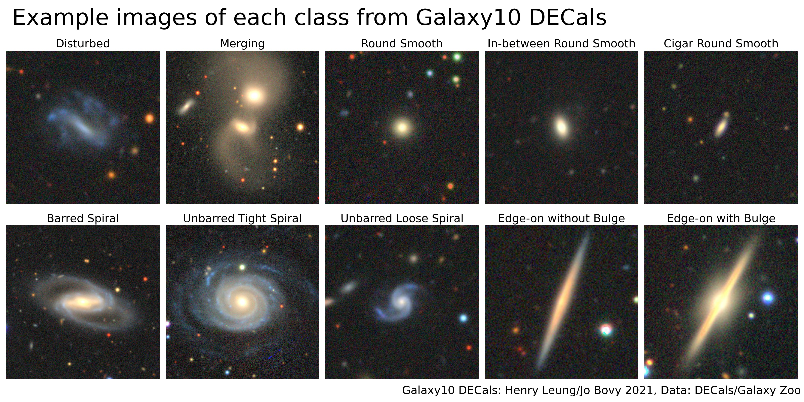

Galaxy10 DECals Dataset
==========================

.. image:: https://img.shields.io/github/license/henrysky/Galaxy10.svg
   :target: https://github.com/henrysky/Galaxy10/blob/master/LICENSE
   :alt: GitHub license

Welcome! Galaxy10 DECals is a much improved version of our original `Galaxy10`_.

The original Galaxy10 dataset was created with Galaxy Zoo (GZ) Data Release 2 where volunteers classify ~270k of SDSS galaxy images where ~22k of those images 
were selected in 10 broad classes using volunteer votes. GZ later utilized images from `DESI Legacy Imaging Surveys`_ (DECals) with much better resolution and 
image quality. Galaxy10 DECals has combined all three (GZ DR2 with images from DESI Legacy Imaging Surveys instead of SDSS images and  DECals campaign ab, c) 
results in ~441k of unique galaxies covered by DECals where ~18k of those images were selected in 10 broad classes using volunteer votes with more rigorous 
filtering. Galaxy10 DECals had its 10 broad classes tweaked a bit so that each class is more distinct from each other and ``Edge-on Disk with Boxy Bulge`` 
class with only 17 images in original Galaxy10 was abandoned. The source code for this dataset is released under this repositary so you are welcome to play 
around if you like, otherwise you can use the compiled Galaxy10 DECals with dowload link below.

Download Galaxy10 DECals
--------------------------

``Galaxy10_DECals.h5``: https://astro.utoronto.ca/~hleung/shared/Galaxy10/Galaxy10_DECals.h5

SHA256: ``19AEFC477C41BB7F77FF07599A6B82A038DC042F889A111B0D4D98BB755C1571``

Size: 2.54 GB

Introduction
---------------

Galaxy10 DECals is a dataset contains 17736 256x256 pixels colored galaxy images (g, r and z band) separated in 10 classes. 
``Galaxy10_DECals.h5`` have columns ``images`` with shape ``(17736, 256, 256, 3)``, ``ans``, ``ra``, ``dec``, 
``redshift`` and ``pxscale`` in unit of arcsecond per pixel

Galaxy10 DECals images come from `DESI Legacy Imaging Surveys`_ which includes the Beijing-Arizona Sky Survey (BASS), 
the DECam Legacy Survey (DECaLS) and the Mayall z-band Legacy Survey and labels come from `Galaxy Zoo`_.

::

    Galaxy10 dataset (17736 images)
    ├── Class 0 (1081 images): Disturbed Galaxies
    ├── Class 1 (1853 images): Merging Galaxies
    ├── Class 2 (2645 images): Round Smooth Galaxies
    ├── Class 3 (2027 images): In-between Round Smooth Galaxies
    ├── Class 4 ( 334 images): Cigar Shaped Smooth Galaxies
    ├── Class 5 (2043 images): Barred Spiral Galaxies
    ├── Class 6 (1829 images): Unbarred Tight Spiral Galaxies
    ├── Class 7 (2628 images): Unbarred Loose Spiral Galaxies
    ├── Class 8 (1423 images): Edge-on Galaxies without Bulge
    └── Class 9 (1873 images): Edge-on Galaxies with Bulge

For more information on the original Galaxy Zoo 2 classification tree: `Galaxy Zoo Decision Tree`_

.. _Galaxy Zoo Decision Tree: https://data.galaxyzoo.org/gz_trees/gz_trees.html

External Catalog Files
--------------------------

Galaxy Zoo Data Release 2 (`Lintott et al. 2011`_) catalog file ``gz2_hart16.csv`` avaliable at https://data.galaxyzoo.org/

Galaxy Zoo DECals (`Walmsley M. et al. 2021`_) catalog files ``gz_decals_volunteers_ab.csv`` and ``gz_decals_volunteers_c.csv`` avaliable at https://zenodo.org/record/4196267#.YE0oZ69KiUm

See acknowledgments for papers describing those catalogs

File Descriptions
------------------

If Github has issue (or too slow) loading the Jupyter Notebooks, you can go
http://nbviewer.jupyter.org/github/henrysky/Galaxy10/tree/master/

-   | `Galaxy10_coord.csv`_ and `Galaxy10_coord.csv.vot`_
    | Galaxy10 DESCals coordinates, you can just use these files to easily cross-match external catalog
-   | `downloader_gzdes_ab_des_dr8.py`_
    | Python script to download all Galaxy Zoo DECals campaign AB images from DECals DR8 (requires ``gz_decals_volunteers_ab.csv`` and long time to run)
-   | `downloader_gzdes_ab_des_dr8.py`_
    | Python script to download all Galaxy Zoo DECals campaign AB images from DECals DR8 (requires ``gz_decals_volunteers_ab.csv`` and long time to run)
-   | `downloader_gzdes_c_des_dr8.py`_
    | Python script to download all Galaxy Zoo DECals campaign C images from DECals DR8 (requires ``gz_decals_volunteers_c.csv`` and long time to run)
-   | `downloader_sdssgz2_des_dr8.py`_
    | Python script to download all Galaxy Zoo Data Release 2 images from DECals DR8 (requires ``gz2_hart16.csv`` and long time to run)
-   | `GZ2-SDSS-dataset.ipynb`_
    | Jupyter Notebook to inspect Galaxy Zoo Data Release 2 catalog ``gz2_hart16.csv``
-   | `GZ-DECaLS-dataset.ipynb`_
    | Jupyter Notebook to inspect Galaxy Zoo DECals catalogs ``gz_decals_volunteers_ab.csv`` and ``gz_decals_volunteers_c.csv``
-   | `CCD-Artifacts.ipynb`_
    | Jupyter Notebook to deal with CCD artifacts
-   | `Size-Estimate.ipynb`_
    | Jupyter Notebook to estimate galaxy size
-   | `Compile-Galaxy10-DES.ipynb`_
    | Jupyter Notebook to compile Galaxy10 DECals

.. _Galaxy10_coord.csv: Galaxy10_coord.csv
.. _Galaxy10_coord.csv.vot: Galaxy10_coord.csv.vot
.. _downloader_gzdes_ab_des_dr8.py: downloader_gzdes_ab_des_dr8.py
.. _downloader_gzdes_c_des_dr8.py: downloader_gzdes_c_des_dr8.py
.. _downloader_sdssgz2_des_dr8.py: downloader_sdssgz2_des_dr8.py
.. _GZ2-SDSS-dataset.ipynb: GZ2-SDSS-dataset.ipynb
.. _GZ-DECaLS-dataset.ipynb: GZ-DECaLS-dataset.ipynb
.. _CCD-Artifacts.ipynb: CCD-Artifacts.ipynb
.. _Size-Estimate.ipynb: Size-Estimate.ipynb
.. _Compile-Galaxy10-DES.ipynb: Compile-Galaxy10-DES.ipynb

Galaxy10 Dataset Authors
-------------------------

-  | **Henry Leung** - henrysky_
   | Department of Astronomy & Astrophysics, University of Toronto

-  | **Jo Bovy** - jobovy_
   | Department of Astronomy & Astrophysics, University of Toronto

.. _henrysky: https://github.com/henrysky
.. _jobovy: https://github.com/jobovy

Acknowledgments
--------------------------

1. Galaxy10 dataset classification labels come from `Galaxy Zoo`_
2. Galaxy10 dataset images come from `DESI Legacy Imaging Surveys`_

Galaxy Zoo is described in `Lintott et al. 2008`_, the GalaxyZoo Data Release 2 is described in `Lintott et al. 2011`_, Galaxy Zoo DECals Campaign is described in 
`Walmsley M. et al. 2021`_, DESI Legacy Imaging Surveys is described in `Dey A. et al., 2019`_

The Legacy Surveys consist of three individual and complementary projects: the Dark Energy Camera Legacy Survey (DECaLS; Proposal ID #2014B-0404; PIs: David Schlegel and Arjun Dey), the Beijing-Arizona Sky Survey (BASS; NOAO Prop. ID #2015A-0801; PIs: Zhou Xu and Xiaohui Fan), and the Mayall z-band Legacy Survey (MzLS; Prop. ID #2016A-0453; PI: Arjun Dey). DECaLS, BASS and MzLS together include data obtained, respectively, at the Blanco telescope, Cerro Tololo Inter-American Observatory, NSF’s NOIRLab; the Bok telescope, Steward Observatory, University of Arizona; and the Mayall telescope, Kitt Peak National Observatory, NOIRLab. The Legacy Surveys project is honored to be permitted to conduct astronomical research on Iolkam Du’ag (Kitt Peak), a mountain with particular significance to the Tohono O’odham Nation.

.. _DESI Legacy Imaging Surveys: https://www.legacysurvey.org/
.. _Galaxy Zoo: https://www.galaxyzoo.org/
.. _Lintott et al. 2008: https://ui.adsabs.harvard.edu/abs/2008MNRAS.389.1179L/abstract
.. _Lintott et al. 2011: https://ui.adsabs.harvard.edu/abs/2011MNRAS.410..166L/abstract
.. _Walmsley M. et al. 2021: https://ui.adsabs.harvard.edu/abs/2021arXiv210208414W/abstract
.. _Dey A. et al., 2019: https://ui.adsabs.harvard.edu/abs/2019AJ....157..168D/abstract
.. _Galaxy10: https://astronn.readthedocs.io/en/latest/galaxy10.html
